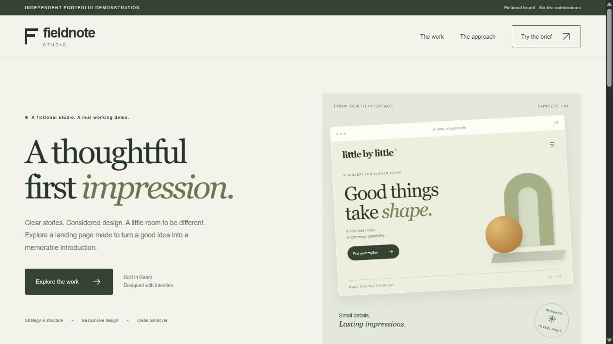
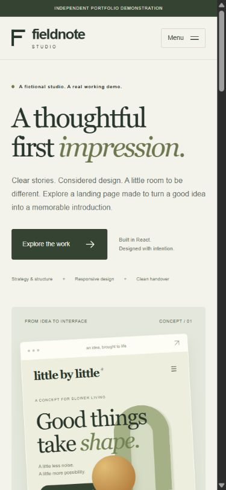

# Fieldnote Studio — React landing page

An original, responsive landing-page demonstration for **Fieldnote Studio**, a fictional creative studio. Built by Dhairya Sharma with AI-assisted development, this project demonstrates front-end implementation, clear product storytelling and privacy-conscious interaction design.

**This is a portfolio concept, not client work.** The miniature brands and design explorations are fictional. There are no real enquiries, commercial results, testimonials or live customer records.

[Try the live demo](https://dhairyadevelops.github.io/react-landing-page/) · [Read the case study](CASE_STUDY.md)

Explore the interface, then read the design decisions, walkthrough and tested boundaries.



<details>
<summary>Mobile preview</summary>



</details>

## What is here

Four content sections, plus a navigation bar and footer:

1. **Introduction:** editorial typography, a clear call to action and a code-built design preview.
2. **Design explorations:** three original layout directions, rendered with HTML/CSS rather than stock assets or external images.
3. **Approach and FAQs:** an accessible button-controlled accordion explaining the demo and its boundaries.
4. **Project brief:** a functional, local-only form that validates an imaginary project and displays a deterministic four-section outline.

The form does **not** use AI inference, submit requests, send messages or save information. Values exist only in React memory until the tab is refreshed. Do not enter personal or confidential information.

## Run locally

Use Node.js 24 or newer and npm. Dependencies are pinned in `package.json` and `package-lock.json`.

```sh
npm ci
npm run dev
```

Open the local URL Vite prints. The development server binds to `127.0.0.1`, not the wider network.

```sh
npm test          # Pure validation and outline-generation tests
npm run build    # Optimized static output in dist/
npm run preview  # Local preview of the production build
```

No API keys, environment variables, accounts, paid services or database are required. Installing dependencies requires a connection to the npm registry.

## Design decisions

- A warm paper, olive and chartreuse palette, balanced with system sans-serif and Georgia typography. No font downloads.
- Fluid layouts with a single-column small-screen presentation. The work samples are visual design concepts, not links to nonexistent projects.
- Original CSS illustrations and small inline SVG interface icons keep the page lightweight and self-contained.
- Explicit demo labels appear at the top, in the FAQ, at the form and in the footer.

## Accessibility and interaction

- Semantic landmarks and heading hierarchy, a skip link, visible focus indicators and text-labelled controls.
- Mobile menu with `aria-expanded`, Escape-to-close, outside-click dismissal and focus movement to a selected section.
- FAQ buttons expose expanded state and label their corresponding answer regions.
- Form labels, inline error descriptions, an error announcement and focus on the first invalid field.
- Successful brief previews receive focus; reset returns focus to the first field.
- Reduced-motion preferences disable smooth scrolling and decorative transitions.
- Textarea content renders as escaped React text; it is never inserted as HTML.

These are implemented safeguards, **not an accessibility certification**. A complete production review still needs assistive-technology and target-browser testing.

## Testing

The Node test suite covers valid combinations, unsupported choices, required input, trimmed length boundaries, invalid-output prevention, input immutability and project-specific section selection. These tests do not replace visual or browser interaction testing.

Suggested manual checks:

- At 1440px, 768px, 390px and 320px: no horizontal overflow, readable labels and usable controls.
- With a keyboard: skip link, navigation, FAQ buttons, form errors, successful preview and reset.
- On mobile: open/close the menu, press Escape, select a navigation destination and verify focus.
- Submit an empty form, then a valid imaginary brief; refresh to confirm the data disappears.
- Enable reduced motion and inspect the page at 200% zoom.
- Test the production build, not only the development server.

## Project structure

```text
public/favicon.svg     Original favicon
src/main.jsx           React components and UI state
src/styles.css         Responsive design and focus/reduced-motion styles
src/brief.js           Pure validation and deterministic outline generation
tests/brief.test.js    Node built-in test suite
index.html             Language, title and social metadata
```

## Scope and limitations

This is a single-page front-end demonstration. It has no backend, authentication, payment processing, analytics, live form delivery or production support. It has no external API calls, remote assets or tracking scripts. During development Vite uses its local hot-reload connection; that is not part of the production bundle.

Before a production launch, replace fictional material with approved content, confirm asset rights, add a privacy-reviewed contact workflow and configure deployment-specific metadata.

## Static demo publishing

`vite.config.js` sets the base path to `/react-landing-page/`. The `docs/` directory is a checked-in static build for GitHub Pages (source: `main`, folder: `/docs`). It is generated output, not a second implementation.

```sh
npm ci
npm test
npm run build:pages
npm run preview -- --outDir docs
```

After changing source files, rebuild and publish the complete updated `docs/` folder. `public/.nojekyll` is copied into the build. Update the Vite base path if hosting under a different URL path. GitHub Pages serves the files; the demo itself sends no form data or analytics.

## Provenance

Created as an independent portfolio demonstration for Dhairya Sharma using AI-assisted drafting and implementation, with automated tests included. This repository does not claim unaided authorship; review and adapt it before production use. No company source code, proprietary evaluation materials, customer data, paid templates or client assets were used. The source is available for inspection; no open-source license has been granted in this repository.
